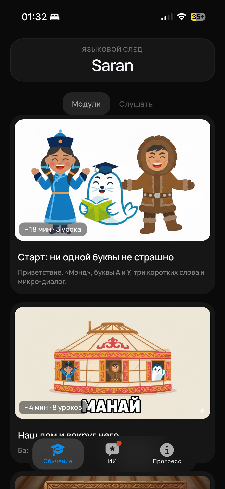
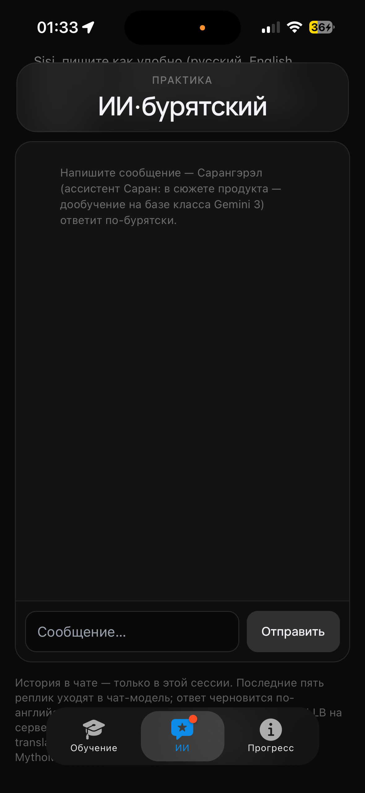
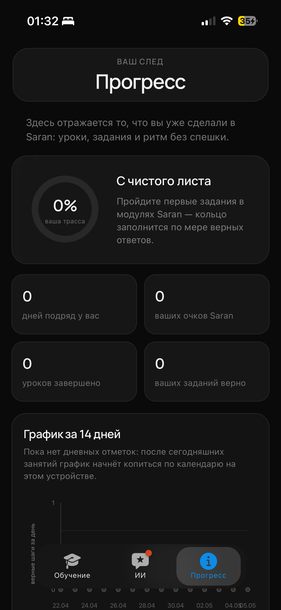
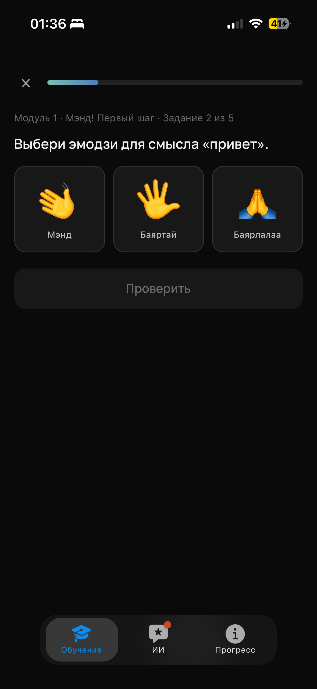
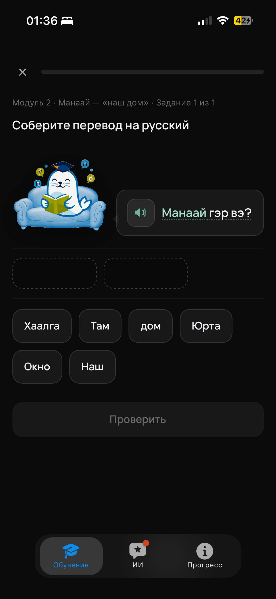

# Saran

**Saran** is a mobile-first website for learning endangered indigenous languages of Russia — starting with Buryat. Open it in any browser, add it to your home screen, and study in short Duolingo-style sessions. No app store, no Telegram — just a live site.

## Why I built this

I grew up around stories that Buryat was “almost gone,” and that always felt wrong. Apps for big languages are everywhere; for languages like Buryat there is almost nothing that respects the script (һ, ө, ү…) and still feels normal on a phone. I wanted a link I could send to friends — something that loads instantly and doesn’t need an install wizard.

## What it does

- **Structured lessons** — modules from first letters and greetings to everyday topics, driven by a JSON curriculum with interactive steps
- **Exercise types** — pick the right emoji, build a translation from word chips, listen where audio exists, get gentle corrections
- **AI practice tab** — chat with **Sarangrel**, a Buryat-only assistant for questions between lessons
- **Progress** — streak, XP, lessons completed, and a 14-day activity chart (stored locally in the browser)
- **PWA** — add the site to your home screen and study in standalone mode
- **Landing page** — context on why this matters, with a map of disappearing languages in Russia

## How to use it

1. Open **[saran-edu.ru/app](https://saran-edu.ru/app/)** on your phone or desktop.
2. Walk through onboarding — pick Buryat, your level, and a daily goal.
3. Tap **Обучение** (Learn) → choose a module → start a lesson → tap **Проверить** after each task.
4. Stuck on a phrase? Open **ИИ** and ask Sarangrel in Buryat Cyrillic.
5. Check **Прогресс** for streak and stats.
6. Optional: use “Add to Home Screen” in Safari/Chrome for a full-screen app feel.

The marketing page lives at **[saran-edu.ru](https://saran-edu.ru/)** — screenshots, project story, and a link straight into the app.

## How it works

The product is a static **PWA** (`app/index.html`) with three bottom tabs: Learn, AI, and Progress. Lesson content lives in `app/data/buryat-curriculum.json`; the client renders each step type (quiz, translation builder, character scenes) without a heavy framework. Progress and profile choices persist in **localStorage**, so returning users keep their streak and completed lessons.

When you use the AI tab, the browser sends chat messages to a small **PHP proxy** (`app/api/openrouter-chat.php`) on the production host. The proxy holds the API key server-side and forwards requests to **OpenRouter**; the assistant is prompted to answer only in Buryat Cyrillic. Optional **NLLB** translation runs through a similar PHP endpoint for helper text when needed.

The repo root holds a separate minified **landing page**. **Vercel** builds both pages (`npm run build`), serves them over HTTPS, and rewrites `/api/*` to the backend VPS. Everything ships as static HTML, CSS, and JavaScript — no native app, no bot runtime in this repo.

## Stack

| Layer | Tech |
|-------|------|
| App UI | HTML, CSS, vanilla JavaScript (PWA) |
| Landing | Static HTML + CSS, minified on deploy |
| Curriculum | JSON schema + generated lesson assets |
| AI chat | OpenRouter (server-side PHP proxy) |
| Translation helper | NLLB via Hugging Face / self-hosted API |
| Hosting | Vercel (front), VPS (API proxy), Reg.ru (PHP) |
| Build | Node (html-minifier-terser, JS obfuscation on deploy) |

## Screenshots

| | |
|---|---|
|  | **Learn** — module list and course cards, from alphabet to home & environment topics |
|  | **AI** — practice dialog with the Buryat assistant between lessons |
|  | **Progress** — streak, points, lessons done, activity chart |
|  | **Lesson** — pick the matching emoji, then tap Check |
|  | **Lesson** — assemble a Russian translation from word chips |

## AI use disclosure

- **Cursor** — helped write and refactor code, draft this README, and debug deploy issues. I reviewed and tested everything myself.
- **OpenRouter (runtime)** — the in-app AI tab calls a hosted LLM through our server proxy. Users see generated Buryat replies from Sarangrel; keys never ship to the browser.
- **OpenRouter (dev only)** — `app/scripts/generate_lesson_assets_openrouter.py` generated a handful of lesson illustrations; those PNGs are committed, the script is not needed to run the app.
- **No AI in the core lesson engine** — quizzes, scoring, and progress are deterministic client logic over the curriculum JSON.

## Links

- **Live app:** https://saran-edu.ru/app/
- **Landing:** https://saran-edu.ru/
- **Community:** [@SaranEdu](https://t.me/SaranEdu) on Telegram
- **Code:** https://github.com/AlexAnikeev-lab/saran-site
- **Contact:** hello@alexanik.ru

## License

MIT — see [LICENSE](LICENSE). Copyright © 2026 Alex Nik.
