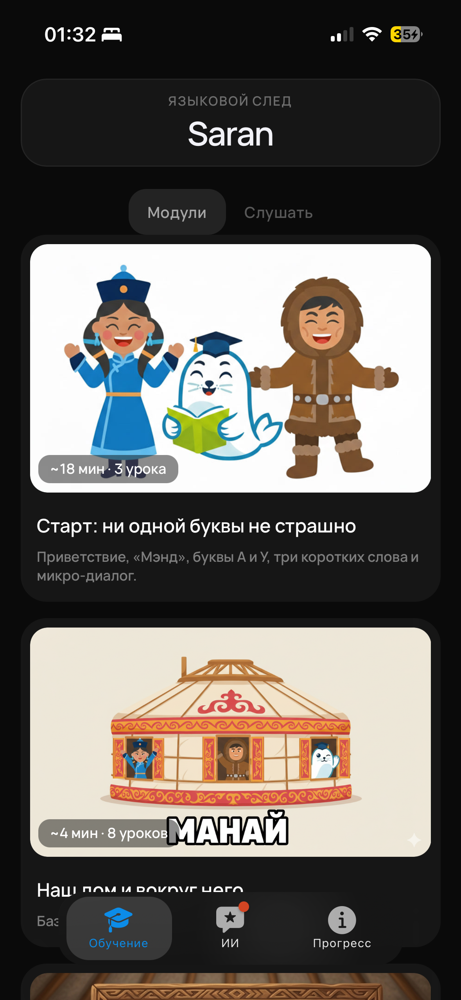
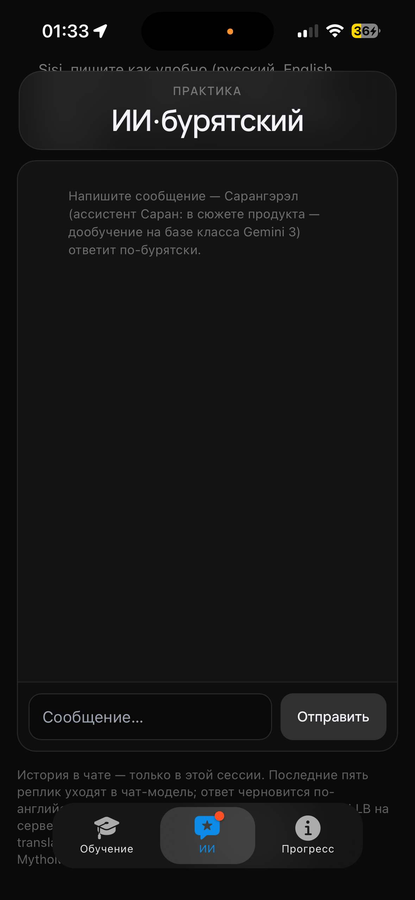
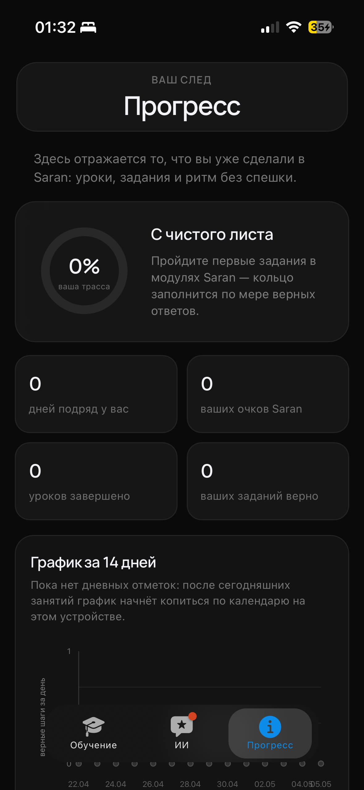
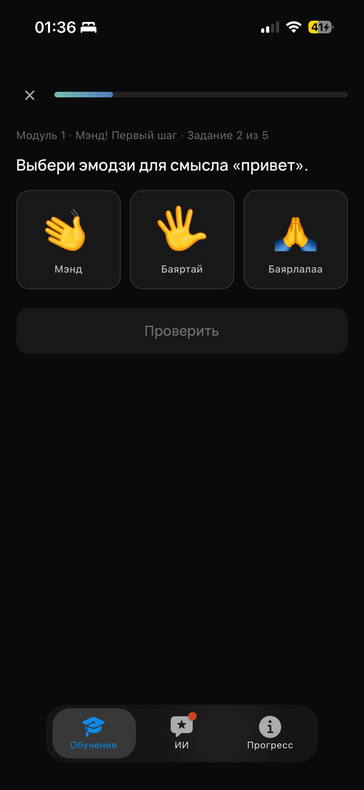
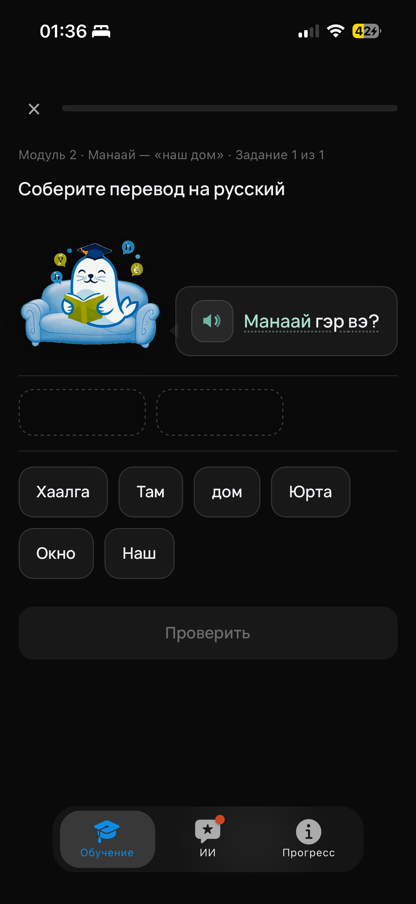

# Saran

Saran is a website for learning endangered indigenous languages of Russia. Right now it's just Buryat, but that's on purpose — I'd rather do one language really well than five languages badly. It's mobile-first, works straight in the browser, and you can add it to your home screen so it feels like a real app. No app store review, no Telegram bot setup, just a link.

## Why I made this

I grew up hearing people say Buryat was "basically dying out" and honestly that never sat right with me. If you go looking for apps to learn Spanish or Japanese there are like fifty of them, all polished, all free. Look for Buryat and you get almost nothing — and the little that exists usually doesn't even support the actual letters (һ, ө, ү) properly, or looks like it was built in 2009 and abandoned. I wanted something I could just send my friends as a link, that opens instantly, and doesn't make them install anything or join a random Telegram bot to use it.

## What's actually in it

Lessons are organized into modules, starting from the alphabet and basic greetings and moving up to everyday topics — all of it pulled from a JSON curriculum file so I'm not hardcoding lesson content into the app itself. Each lesson mixes a few exercise types: pick the right emoji for a word, drag word chips into the right order to build a translation, listen to audio where I've got it, that kind of thing. Wrong answers get a gentle nudge instead of just an X.

There's also an AI tab where you can chat with Sarangrel, an assistant that only replies in Buryat, for practicing between lessons. Progress (streak, XP, lessons finished, a 14-day activity graph) is saved locally in your browser — no account needed. And the whole thing is a PWA, so "Add to Home Screen" gives you a real full-screen app feel on your phone.

There's also a separate landing page explaining why this project exists, with a map showing how many languages in Russia are actually endangered — it's more than people think.

## How to actually use it

1. Open [saran-edu.ru/app](https://saran-edu.ru/app/) on your phone or on desktop, doesn't matter which.
2. Go through onboarding — pick Buryat, say roughly what level you're at, set a daily goal (or don't, up to you).
3. Tap **Обучение** (that's "Learn"), pick a module, start a lesson, and hit **Проверить** after each task to check your answer.
4. If a phrase confuses you, just open the **ИИ** tab and ask Sarangrel about it in Buryat.
5. **Прогресс** shows your streak and stats if you're into that stuff.
6. On Safari or Chrome you can hit "Add to Home Screen" so it opens like a full app instead of a browser tab.

The marketing/landing page is at [saran-edu.ru](https://saran-edu.ru/) if you want screenshots and the backstory before jumping into the app itself.

## How it's actually built

It's a static PWA — `app/index.html` — with three tabs at the bottom: Learn, AI, and Progress. All the lesson content lives in `app/data/buryat-curriculum.json`, and the client just renders whatever step type that lesson needs (quiz, translation builder, little character scenes) without pulling in some heavy framework for it. Progress and whatever you picked during onboarding get saved in localStorage, so if you come back later your streak and finished lessons are still there.

The AI tab isn't calling anything directly from the browser — it hits a small PHP proxy (`app/api/openrouter-chat.php`) sitting on the production server, which holds the actual API key and forwards the request to OpenRouter. The model's prompted to only answer in Buryat Cyrillic. There's also an NLLB translation endpoint doing something similar for helper text when it's needed.

The landing page is a separate, minified thing living in the repo root. Vercel builds both (`npm run build`) and serves everything over HTTPS, rewriting `/api/*` calls to the backend VPS. It's all static HTML/CSS/JS in the end — there's no native app and no bot process running out of this repo.

## Stack

| Layer | Tech |
|-------|------|
| App UI | HTML, CSS, vanilla JavaScript (PWA) |
| Landing | Static HTML + CSS, minified on deploy |
| Curriculum | JSON schema + generated lesson assets |
| AI chat | OpenRouter (server-side PHP proxy) |
| Translation helper | NLLB via Hugging Face / self-hosted API |
| Hosting | Vercel (front), VPS (API proxy), Reg.ru (PHP) |
| Build | Node (html-minifier-terser, JS obfuscation on deploy) |

## Screenshots

| | |
|---|---|
|  | **Learn** — the module list, from alphabet stuff up to home & environment topics |
|  | **AI** — chatting with Sarangrel between lessons |
|  | **Progress** — streak, points, lessons done, activity graph |
|  | **Lesson** — pick the matching emoji, then hit Check |
|  | **Lesson** — build a Russian translation out of word chips |

## Being honest about AI use

I used Cursor while building this — it helped with writing/refactoring code and figuring out deploy issues when things broke. I read and tested everything it touched myself, this isn't a "generate the app" situation.

The in-app AI tab is a real feature, not a dev tool: it calls OpenRouter through my server so the API key never touches the browser, and that's what actually powers Sarangrel's replies.

Separately, I used OpenRouter once during development to generate a handful of lesson illustration images with a script (`app/scripts/generate_lesson_assets_openrouter.py`). Those PNGs are just committed to the repo now — you don't need the script to run the app.

The actual lesson engine — quizzes, scoring, progress tracking — has zero AI in it. It's just deterministic JS logic running over the curriculum JSON.

## Links

- **Live app:** https://saran-edu.ru/app/
- **Landing:** https://saran-edu.ru/
- **Community:** [@SaranEdu](https://t.me/SaranEdu) on Telegram
- **Code:** https://github.com/AlexAnikeev-lab/saran-site
- **Contact:** hello@alexanik.ru

## License

MIT — see [LICENSE](LICENSE). Copyright © 2026 Alex Nik.
